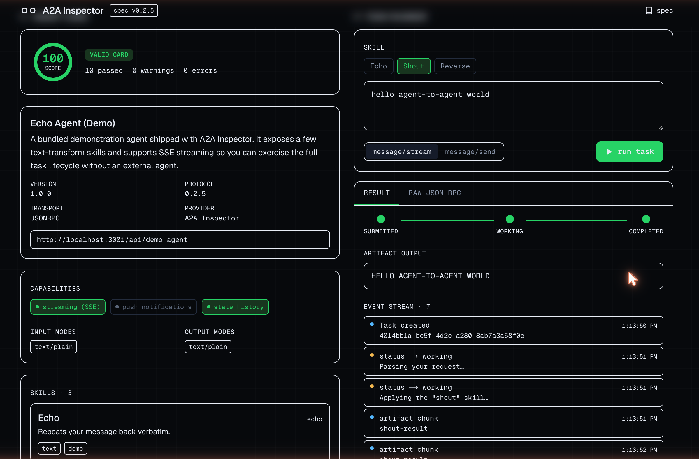

# A2A Inspector


A **Postman for Google's [Agent2Agent (A2A) protocol](https://a2a-protocol.org/)**. Paste an
agent URL to validate its Agent Card against the A2A spec (**v0.2.5**), then fire live tasks
and watch the task lifecycle stream in real time.

<p align="center">
  
</p>

## Contents

- [What it does](#what-it-does)
- [How it works](#how-it-works)
- [Finding agents & cards to test](#finding-agents--cards-to-test)
- [Tech](#tech)
- [Develop](#develop)
- [Project layout](#project-layout)
- [Deploy](#deploy)
- [Limitations](#limitations)
- [Contributing](#contributing)
- [Code of Conduct](#code-of-conduct)
- [License](#license)
- [Acknowledgements](#acknowledgements)

## What it does

- **Agent Card validator** — resolves `/.well-known/agent-card.json` (with legacy
  `/.well-known/agent.json` fallback), validates every required and recommended field against
  the spec, and renders a scored, field-by-field report.
- **Task runner** — pick a skill, compose a message, and call `message/send` (synchronous) or
  `message/stream` (SSE). A live state-machine timeline tracks the task through
  `submitted → working → completed`, with a color-coded event feed and artifact output.
- **Raw inspector** — the underlying JSON-RPC request and response/event stream, pretty-printed.
- **Bundled demo agent** — a fully spec-compliant A2A agent ships with the app, so the Inspector
  is self-demoing on first load. Click **▶ bundled demo agent**.
- **Dark / light theme** — an OLED "operations console" dark theme and a matching light theme.
  The toggle (header, top-right) persists to `localStorage`; first load follows your OS preference.

## How it works

```
browser ──> /api/proxy/card    ──> GET  {agent}/.well-known/agent-card.json
        ──> /api/proxy/rpc     ──> POST {agent}  (message/send, tasks/get, …)
        ──> /api/proxy/stream  ──> POST {agent}  (message/stream, SSE relayed back)

demo agent:  /api/demo-agent                  (JSON-RPC endpoint)
             /.well-known/agent-card.json      (rewritten → /api/demo-agent/card)
```

All agent traffic is proxied **server-side** — the browser never calls a third-party agent
directly. This dodges CORS and lets the server relay Server-Sent Events. No card or task data is
persisted.

## Finding agents & cards to test

The input box accepts either a **base origin** (it appends `/.well-known/agent-card.json`, then
the legacy `/.well-known/agent.json`) or a **direct URL** to a card ending in `.json`. So there
are two ways to exercise the app:

**Validate a card** — needs only a hosted JSON document, not a running agent:

| Target | Paste this |
| --- | --- |
| Bundled demo agent (valid, live) | click **▶ bundled demo agent**, or paste the app's own URL |
| Sample: valid card (100, live-runnable) | `https://a2a-inspector.davidcjw.com/samples/valid.json` |
| Sample: valid-with-warnings (amber path) | `https://a2a-inspector.davidcjw.com/samples/warnings.json` |
| Sample: malformed card (error path) | `https://a2a-inspector.davidcjw.com/samples/invalid.json` |
| Any card you host | a raw GitHub / gist URL, or any `…/agent-card.json` |

The three sample cards live in [`public/samples/`](public/samples) and ship with the app, so they
also work locally at `http://localhost:3000/samples/*.json`.

**Run live tasks** (`message/send` / `message/stream`) — needs a real running agent:

- **Bundled demo agent** — the simplest live target; the `valid.json` sample also points at it.
- **[a2aproject/a2a-samples](https://github.com/a2aproject/a2a-samples)** — runnable example
  agents (ADK, LangGraph, CrewAI, JS, …). Run one locally and point the Inspector at
  `http://localhost:PORT` — the proxy's SSRF guard allows localhost for exactly this.
- **[A2A spec](https://a2a-protocol.org/v0.2.5/specification/)** — example Agent Card JSON you can
  host and validate.

> Note: always-on **public** A2A agents on the open internet are still scarce and churn often, so
> the reliable test targets are the bundled demo and locally-run samples.

## Tech

- Next.js 16 (App Router, Turbopack) · React 19 · TypeScript
- Tailwind CSS v4 · Geist / Geist Mono
- Zero runtime dependencies beyond the framework; the Agent Card validator is pure and tested.

## Develop

```bash
npm install
npm run dev      # http://localhost:3000
npm test         # validator + demo-agent unit tests (vitest)
npm run lint
npm run build
```

## Project layout

| Path | Purpose |
| --- | --- |
| `lib/a2a-types.ts` | A2A protocol model (Agent Card, Task, Message, stream events) |
| `lib/validate-card.ts` | Pure, dependency-free Agent Card validator (tested) |
| `lib/demo-agent.ts` | Logic for the bundled demonstration agent |
| `lib/client.ts` | Browser-side proxy calls + SSE parsing |
| `app/api/proxy/*` | Server-side relays (`card`, `rpc`, `stream`) |
| `app/api/demo-agent/*` | The bundled A2A agent + its card |
| `components/*` | `CardReport`, `TaskRunner`, `TaskTimeline`, `JsonBlock` |

## Deploy

Deploys to Vercel as-is (SSE streaming is supported natively). The demo agent's card URL is
derived from the request origin, so it works on previews and production without configuration.

## Limitations

- Authenticated agents (API key / OAuth security schemes) aren't yet wired into the request UI.
- Push-notification config methods are validated on the card but not exercised by the runner.
- The proxy blocks link-local / cloud-metadata addresses but otherwise fetches arbitrary URLs.

## Contributing

Contributions are welcome! Please open an issue first to discuss what you'd like to change.

1. Fork the repo
2. Create a feature branch (`git checkout -b feature/your-feature`)
3. Commit your changes (`git commit -m 'feat: describe change'`)
4. Push and open a pull request

Please make sure `npm test`, `npm run lint`, and `npm run build` all pass before submitting a PR.

## Code of Conduct

This project follows the [Contributor Covenant v2.1](https://www.contributor-covenant.org/version/2/1/code_of_conduct/).
By participating you agree to uphold a welcoming, harassment-free environment.

## License

Distributed under the MIT License. See [LICENSE](LICENSE) for details.

## Acknowledgements

- The [Agent2Agent (A2A) protocol](https://a2a-protocol.org/) and its [v0.2.5 specification](https://a2a-protocol.org/v0.2.5/specification/) — the standard this tool validates against.
- Built with [Next.js](https://nextjs.org/), [React](https://react.dev/), and [Tailwind CSS](https://tailwindcss.com/), using the [Geist](https://vercel.com/font) typeface.
